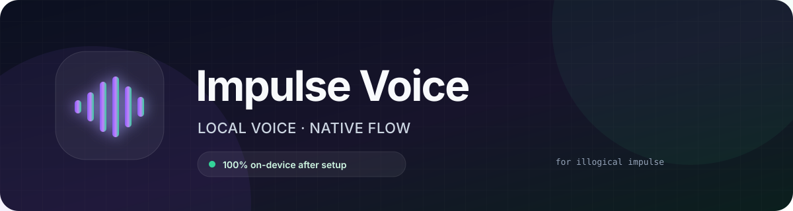

<p align="center">
  
</p>

<p align="center">
  <strong>Hold. Speak. Release. Your words appear where you are typing.</strong>
</p>

<p align="center">
  
  
  
  
</p>

Impulse Voice is a private, push-to-talk dictation component built directly
into the [Illogical Impulse](https://github.com/end-4/dots-hyprland)
Quickshell desktop. It captures your microphone through PipeWire, transcribes
locally with Moondream Parakeet Redux (derived from NVIDIA Parakeet v3), and inserts the result into the
focused application.

After the one-time model download, audio, inference, and text insertion stay
entirely on your machine. There are no accounts, API keys, cloud requests,
analytics, or background microphone sessions.

> [!IMPORTANT]
> Impulse Voice is an independent community project. It is not affiliated with
> Illogical Impulse, Moondream, NVIDIA, or Handy.

## Why it feels native

This is not a floating transcription app placed on top of your desktop. The
installer adds a real Quickshell module to Illogical Impulse:

- the compact waveform capsule uses the active Illogical Impulse colors,
  outline, and rounding;
- its bars react to the local microphone level and switch animation with the
  recording lifecycle;
- global shortcuts are registered through Quickshell and Hyprland;
- the overlay never steals focus from the application receiving the text;
- recording state travels over a small local Unix socket;
- the daemon runs as a user-level systemd service;
- terminal windows receive text without unsafe modifier injection.

```text
Super + Alt + V
       │ hold
       ▼
 PipeWire microphone ──► mono 16 kHz ──► Parakeet Redux ──► focused app
       ▲                                                        │
       └──────────────────── release to transcribe ─────────────┘
```

## Features

- Native Illogical Impulse QML component with an audio-reactive waveform
- Dedicated listening, processing, success, and error animations
- Push-to-talk and click-to-toggle dictation modes
- CPAL capture through the PipeWire/ALSA compatibility layer
- Multichannel downmixing and 16 kHz resampling with Rubato
- Local Parakeet Redux 1.58-bit inference through Photon on CPU
- Lazy model loading with automatic unload after 10 minutes of inactivity
- Context-aware Wayland insertion for terminals and regular applications
- Clipboard restoration after paste
- Hardware/model diagnostics and WAV transcription commands
- Idempotent installer, clean uninstaller, and user-level systemd service

## Privacy model

| Data | Destination | Retained? |
| --- | --- | --- |
| Microphone samples | In-memory daemon buffer | No |
| Speech recognition | Local Photon worker, connected by private pipes | No cloud transfer |
| Transcript | Focused application | Not stored by Impulse Voice |
| Model download | Hugging Face pinned revision, once during setup | Model stays local |

The microphone stream exists only between `start` and `stop`. Setup downloads
the Python runtime dependencies and a pinned model revision; the weights are
verified with SHA-256. Inference uses local files with Hugging Face offline mode
and telemetry disabled. Audio travels in memory over private pipes.

## Requirements

Impulse Voice currently targets:

- CachyOS or Arch Linux
- Hyprland
- Quickshell
- the `ii` configuration of Illogical Impulse
- PipeWire with WirePlumber
- a Rust toolchain
- [uv](https://docs.astral.sh/uv/) (installs an isolated Python 3.12 environment)

Install the system dependencies:

```bash
sudo pacman -S --needed \
  base-devel alsa-lib pipewire pipewire-alsa wireplumber \
  wl-clipboard wtype curl
```

Rust can be installed through `rustup` or the Arch repositories. `ydotool` is
optional and used only as a keyboard-insertion fallback.

## Install

Clone the repository and run:

```bash
git clone https://github.com/TLinvest/Impulse-Voice.git
cd impulse-voice
./scripts/install.sh
```

The installer:

1. installs Photon 2.4.0 and CPU PyTorch in a dedicated environment;
2. downloads Parakeet Redux (~178 MB of weights) and verifies its pinned SHA-256;
3. builds and installs the Rust daemon;
4. creates and enables the user systemd service;
5. installs the Quickshell service and capsule;
6. patches `IllogicalImpulseFamily.qml` idempotently;
7. adds a managed block to the custom Hyprland keybindings;
8. reloads only the desktop components that changed;
9. runs the built-in diagnostic.

Installer options:

```bash
./scripts/install.sh --no-model       # keep an existing model
./scripts/install.sh --no-quickshell  # install only the daemon
./scripts/install.sh --no-start       # do not start the service
```

> [!NOTE]
> The first Quickshell reload may show Illogical Impulse's “Kill conflicting
> programs?” dialog for `kded6`. Choose **No**. Impulse Voice does not need to
> stop `kded6`, and unchanged reinstalls do not reload Quickshell.

## Use

| Shortcut | Action |
| --- | --- |
| Hold `Super+R` | Record while held; transcribe and insert on release |
| `Super+Alt+V` | Start/stop toggle mode |
| `Super+Escape` | Cancel the current recording |

The first transcription loads Parakeet into memory and is slower. Later
transcriptions reuse the warm model.

Quickshell IPC is also available:

```bash
qs -c ii ipc call impulseVoice start
qs -c ii ipc call impulseVoice stop
qs -c ii ipc call impulseVoice toggle
qs -c ii ipc call impulseVoice cancel
```

## Diagnostics

```bash
impulse-voice-daemon --doctor
impulse-voice-daemon --list-input-devices
impulse-voice-daemon --warmup
systemctl --user status impulse-voice.service
journalctl --user -u impulse-voice.service -f
```

Test inference without opening the microphone:

```bash
impulse-voice-daemon --transcribe-wav /path/to/16khz-mono.wav
```

Select a non-default CPAL input device by adding an environment override to the
systemd service:

```bash
systemctl --user edit impulse-voice.service
```

```ini
[Service]
Environment=IMPULSE_VOICE_INPUT_DEVICE=exact CPAL device name
```

Then reload and restart:

```bash
systemctl --user daemon-reload
systemctl --user restart impulse-voice.service
```

See [Troubleshooting](docs/troubleshooting.md) for audio, model, shortcut, and
text-insertion issues.

## Configuration paths

```text
~/.local/bin/impulse-voice-daemon
~/.local/share/impulse-voice/models/parakeet-redux/
~/.config/systemd/user/impulse-voice.service
~/.config/quickshell/ii/services/ImpulseVoiceService.qml
~/.config/quickshell/ii/modules/ii/impulseVoice/ImpulseVoice.qml
```

Environment variables:

| Variable | Purpose |
| --- | --- |
| `IMPULSE_VOICE_PYTHON` | Override the Photon environment Python executable |
| `IMPULSE_VOICE_MODEL` | Override the complete model directory |
| `IMPULSE_VOICE_MODEL_ROOT` | Override the model download parent directory |
| `IMPULSE_VOICE_INPUT_DEVICE` | Select an exact CPAL input-device name |
| `IMPULSE_VOICE_SOCKET` | Override the Unix-socket path |
| `RUST_LOG` | Adjust daemon logging |

## Uninstall

```bash
./scripts/uninstall.sh
```

The model is intentionally retained to avoid another large download. Remove
`~/.local/share/impulse-voice` manually if you also want to delete the model.

## Development

```bash
cargo fmt --check
cargo test
cargo clippy --all-targets -- -D warnings
bash -n scripts/*.sh
```

Read the [architecture](docs/architecture.md), [IPC protocol](docs/protocol.md),
and [contribution guide](CONTRIBUTING.md) before making structural changes.

## Credits

- [Illogical Impulse](https://github.com/end-4/dots-hyprland) by end-4
  provides the desktop this component integrates with.
- [NVIDIA Parakeet TDT 0.6B v3](https://huggingface.co/nvidia/parakeet-tdt-0.6b-v3)
  provides the speech-recognition model and is licensed under CC BY 4.0.
- [Moondream Parakeet Redux](https://huggingface.co/moondream/parakeet-redux)
  supplies the compressed CC BY 4.0 weights; Photon supplies the local runtime.
- [Handy](https://github.com/cjpais/Handy) inspired the local dictation direction.

Impulse Voice source code is available under the [MIT License](LICENSE).
See [Third-party notices](THIRD_PARTY_NOTICES.md) for model and dependency
attribution.

## Redux migration

Redux reduces model weight size, but Photon and CPU PyTorch add installation
space beyond the 178 MB checkpoint. Published French FLEURS WER is 7.71%,
versus 4.81% for the original v3; compression trades some French accuracy for
size and CPU performance. Actual dictation speed and accuracy depend on hardware
and speech. See the [model benchmarks](https://huggingface.co/moondream/parakeet-redux).

Existing v3 model directories are retained during upgrade. `--no-model` now
requires an existing **Redux** model. The Python environment lives under
`$XDG_DATA_HOME/impulse-voice/photon-venv` (default `~/.local/share`).
